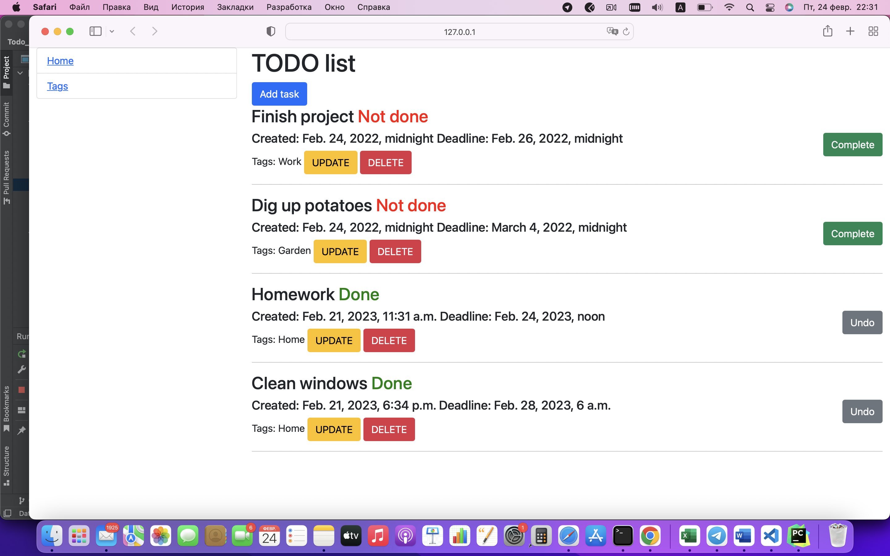

# Todo-list project
Django-project which helps people to edit plans
# Installation

git clone https://github.com/Bohdan2001007/Todo-list.git

cd Todo-list

python3 -m venv venv

source venv/bin/activate

pip install -r requirements.txt

python3 manage.py runserver

# Demo

